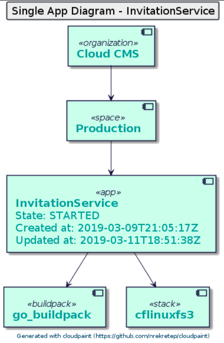

# cloudpaint-cli

This is the command line interface (cli) for the [cloudpaint library](https://github.com/nrekretep/cloudpaint).

This project only exists because I wanted to learn the go programming language. And because I am also a big fan of big picture diagrams for software I created cloudpaint and cloudpaint-cli.

## Get cloudpaint library

```bash
$ mkdir -p $GOPATH/src/github.com/nrekretep
$ cd $GOPATH/src/github.com/nrekretep
$ git clone https://github.com/nrekretep/cloudpaint.git
```

## Get cloudpaint cli

```bash
$ mkdir -p $GOPATH/src/github.com/nrekretep
$ cd $GOPATH/src/github.com/nrekretep
$ git clone https://github.com/nrekretep/cloudpaint-cli.git
```
## Build it
```bash
$ cd $GOPATH/src/github.com/nrekretep
$ go -o cldpnt cloudpaint-cli/main.go
```
## Getting help

```bash
$ cd $GOPATH/src/github.com/nrekretep
$ ./cldpnt
$ Please use -h flag for correct usage.

$ ./cldpnt -h
$ Usage of ./cldpnt:
  -a string
    	URL of the Cloud Controller API.
  -appguid string
    	Single app guid.
  -d string
    	Name of the diagram to paint.
  -p string
    	Password used for Cloudfoundry login.
  -u string
    	Username used for Cloudfoundry login.
```

## Use it

As the name implies this is a command line interface so you need to use the correct command line parameters. 

```bash
$ cd $GOPATH/src/github.com/nrekretep
$ ./cldpnt -a=https://api.run.pivotal.io -u=<youruser> -p=<yourpassword> -d=single-app -appguid=<yourappguid>
```

The diagram in [PlantUML Syntax](http://www.plantuml.com/) will be printed to the console. 

To render the diagram you need to send the output to a PlantUML rendering service like [PlanUML Online](http://www.plantuml.com/plantuml/uml/).

## Supported diagram types

* single-app - Shows all dependencies for a single app.

